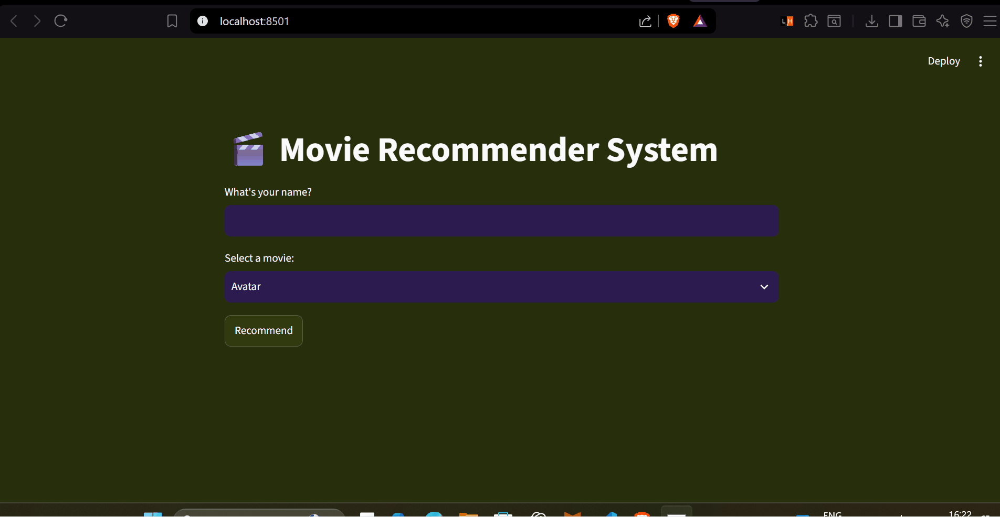

# 🎬 Movie Recommender System

A content-based movie recommendation web app — pick a movie you like, and get 5 similar recommendations with posters, powered by TF-IDF vectorization and cosine similarity.



🔗 **Live App:** https://movie-recommender-abhishek.streamlit.app/
📓 **Original Notebook (Kaggle):** [content-wise-movie-reccomendations](https://www.kaggle.com/code/superviseddeep/content-wise-movie-reccomendations)

---

## ✨ Features

- Select any movie from a searchable dropdown and get 5 similar recommendations
- Recommendations shown with posters, fetched live from the TMDB API
- Personalized greeting using your name
- Clean, custom dark theme

---

## 🧠 How It Works

This is a **content-based filtering** system — recommendations are generated purely from movie metadata (genre, plot, cast, director, keywords), not from user ratings or behavior. It's an unsupervised learning approach: there are no labels to predict, only similarity to measure.

**Pipeline:**
1. **Data cleaning** — merged TMDB 5000 movies + credits datasets, parsed JSON-string columns (genres, keywords, cast, crew), kept top 3 cast members and the director
2. **Text preprocessing** — stripped punctuation, removed spaces within multi-word names to avoid token collisions, applied stemming (NLTK `PorterStemmer`)
3. **Feature combination** — merged genre, overview, keywords, cast, and crew into a single `tags` string per movie
4. **Vectorization** — converted tags into numerical vectors using `TfidfVectorizer` (stop words removed automatically)
5. **Similarity** — computed a cosine similarity matrix across all movies
6. **Recommendation** — for a selected movie, the top 5 most similar movies (by cosine similarity) are returned
7. **Posters** — fetched at request time via the TMDB API using each movie's `id`

---

## 🛠️ Tech Stack

- **Python**
- **Pandas, NumPy** — data processing
- **Scikit-learn** — TF-IDF vectorization, cosine similarity
- **NLTK** — stemming
- **Streamlit** — web app / UI
- **TMDB API** — movie posters
- **gdown** — fetching the large similarity matrix from Google Drive at runtime

---

## 📁 Project Structure

```
movie-recommender/
├── app.py                 # Streamlit UI
├── recommender.py         # Recommendation engine (loads models, computes similarity)
├── utils.py                # Helper functions (TMDB poster fetching)
├── config.py                # Paths, API keys, constants (loaded from .env)
├── models/
│   ├── movies.pkl            # Processed movie data
│   └── similarity.pkl        # Cosine similarity matrix (hosted on Google Drive — too large for GitHub)
├── notebooks/
│   └── content-wise-movie-reccomendations.ipynb   # Original data cleaning + modeling notebook
├── assets/
│   └── demo.gif               # App demo
├── requirements.txt
├── .gitignore
└── README.md
```

---

## ⚙️ Running Locally

```bash
# Clone the repo
git clone <https://github.com/abhishekagrawal14/100-days-of-ml-challenge.git>
cd movie-recommender

# Install dependencies
pip install -r requirements.txt

# Add your TMDB API key
echo "TMDB_API_KEY=your_key_here" > .env

# Run the app
streamlit run app.py
```

> Note: `similarity.pkl` is fetched automatically from Google Drive on first run if not already present locally (see `config.py`).

---

## 🚧 Notes on Design Decisions

- **No train-test split / accuracy metric** — since this is unsupervised (no ground-truth labels for "correct" recommendations), the model was validated manually by checking whether outputs made intuitive sense (e.g. *The Dark Knight Rises* → other Batman movies, *Toy Story* → its sequels).
- **`similarity.pkl` hosted on Google Drive, not GitHub** — the matrix is ~184MB, over GitHub's 100MB limit, so it's downloaded at runtime via `gdown` instead of being committed to the repo.
- **Secrets kept out of version control** — the TMDB API key is loaded via a `.env` file (gitignored) using `python-dotenv`, rather than hardcoded.

---

## 🔮 Possible Future Improvements

- Hybrid recommendations (combine with collaborative filtering)
- Deploy with a persistent backend instead of runtime Drive downloads
- Add filtering by genre/year

---

## 📚 Part of

This project is part of my https://github.com/abhishekagrawal14/100-days-of-ml-challenge.git 